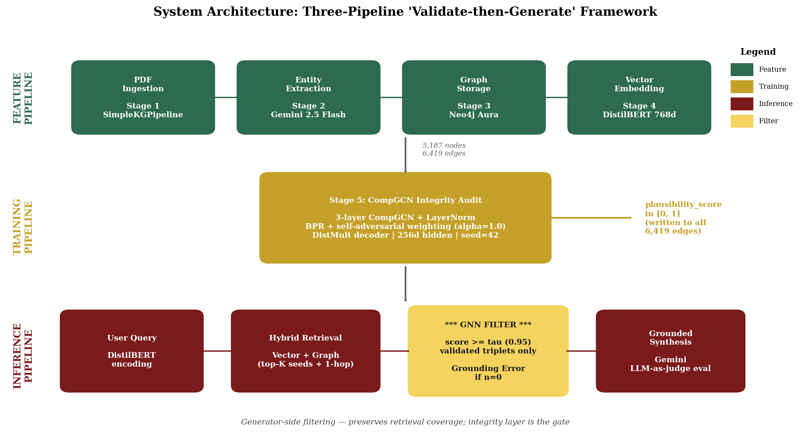

# The Remembrance Vault

A **Validate-then-Generate** knowledge framework: PDFs become a knowledge graph, a CompGCN integrity layer scores every relationship, and synthesis is restricted to the validated subgraph. The system refuses to hallucinate — returning a hard **Grounding Error** when no validated triplets survive the τ-threshold.

> BS Software Engineering capstone project, Central Philippine University.
> Paper: *A GNN-Augmented Framework for Semantic Integrity Validation and Grounded Reasoning in Professional Knowledge Systems*. Latest revision: `Project Study Report_ The Remembrance 6.4.docx`.

## Architecture (three pipelines)



*Paper v6.4 · Figure 5.0 — also rendered on the live `/config` page so the operator view matches the thesis figure.*

1. **Feature pipeline** — PDF → SimpleKGPipeline (Gemini extraction) → Neo4j entities/relationships with provenance → DistilBERT 768-dim embeddings on nodes
2. **Training pipeline** — CompGCN link prediction → plausibility scores (0.0–1.0) on every edge via DistMult composition
3. **Inference pipeline** — Query → hybrid vector + graph retrieval → generator-side filtering at τ ≥ 0.95 → Gemini synthesis → Detective Board evidence trail

The frontend is a proof-of-concept reference UI. The research contribution is the **Validate-then-Generate** pattern, not the dashboard.

## Quick Start

### Backend

```bash
cd backend
python -m venv venv311
.\venv311\Scripts\activate     # Linux/macOS: source venv311/bin/activate
pip install -r requirements.txt

cp .env.example .env            # then edit values
uvicorn src.api.main:app --reload --host 0.0.0.0 --port 8000
```

Required env vars: `NEO4J_URI`, `NEO4J_PASSWORD`, `GOOGLE_API_KEY`. Strongly recommended: `ADMIN_API_KEY` (locks `POST /reset`), explicit `CORS_ORIGINS` (the default `*` is rejected in production). See `backend/.env.example` for the full annotated list of ~50 configurable parameters.

### Frontend

```bash
cd frontend
npm install
npm run dev
```

Open <http://localhost:3000>. To match a non-default backend URL or admin key, set:

```bash
# frontend/.env.local
NEXT_PUBLIC_API_URL=http://localhost:8000
NEXT_PUBLIC_ADMIN_API_KEY=<must-match-backend-ADMIN_API_KEY-or-omit>
```

## API

When the backend is running, OpenAPI docs are at:
- Swagger UI: <http://localhost:8000/docs>
- ReDoc: <http://localhost:8000/redoc>

Chat endpoint `POST /chat` (and SSE variant `POST /chat/stream`) accepts:
- `mode: "graph"` (default) — full stack: hybrid retrieval + GNN filter
- `mode: "graph_no_gnn"` — graph retrieval without plausibility filter (ablation)
- `mode: "prompt_only"` — chunk RAG, no graph (ablation baseline)

## Defense-day quickstart

Before a live demo, run the preflight script to restore the Run 8 (DistMult + BPR + self-adv) recommended configuration into Neo4j and refresh the evaluation results:

```bash
cd backend
python -m run_logs.restore_defense_state
```

This script:
1. Re-syncs the Run 8 checkpoint scores into Neo4j (overwriting any prior state).
2. Verifies the score distribution (expects avg ~0.97, max ~1.00).
3. Re-runs the three-mode ablation (`full_stack` / `graph_no_gnn` / `prompt_only`).
4. Re-runs the threshold sweep at τ ∈ {0.30, 0.50, 0.85, 0.95}.
5. Prints a `PREFLIGHT_SUMMARY` with every headline number.

If you want to evaluate against the corpus-aligned legal query set (instead of the paper's generic five), set `EVALUATION_QUERIES_FILE=evaluation_queries_legal.json` before running.

## Evaluation targets

See `EVALUATION.md` for the full table. Paper v6.4 reports Grounding 0.988 / Faithfulness 0.971 / AUC-ROC 0.985 / MRR 0.958 — all four KPIs PASS at τ = 0.95. MRR is reported under canonical KGE methodology (multi-seed mean, n = 12) per Sun+ 2019 and Vashishth+ 2020.

## Testing

```bash
cd backend
pytest                          # 32 tests, 1 pre-existing fail (test_health when Neo4j unreachable)
```

## Repo map

| Path | Purpose |
|------|---------|
| `backend/src/api/main.py` | FastAPI REST API (12 endpoints) |
| `backend/src/ingestion.py` | PDF → KG pipeline with provenance |
| `backend/src/embed_nodes.py` | DistilBERT node embedding |
| `backend/src/retriever.py` | Hybrid vector + graph retrieval |
| `backend/src/gnn_module.py` | CompGCN training, evaluation, score sync |
| `backend/src/generator.py` | Orchestrates retrieval + synthesis (3 modes) |
| `backend/src/synthesis.py` | Gemini narrative generation |
| `backend/src/evaluation.py` | Grounding/faithfulness LLM-as-judge |
| `backend/run_logs/restore_defense_state.py` | Pre-defense preflight script |
| `backend/TUNING_LOG.md` | Run-by-run training campaign log |
| `frontend/app/page.tsx` | Main dashboard (Overview / Pipeline / Discover / Audit tabs) |
| `frontend/app/evidence/page.tsx` | Evidence trail / Detective Board / KnowledgeGraph |
| `frontend/components/KPIDefenseStatus.tsx` | Paper KPI banner on Overview |
| `docs/paper/` | Paper revision scripts, figures, technical inventory |

## License

Academic / research use. Not deployment-ready as-is: `/ingest`, `/audit`, `/evaluate*`, `/upload`, and `DELETE /documents/{filename}` endpoints are unauthenticated for the local demo flow. Add an admin guard (`X-Admin-Key`) before exposing publicly.
