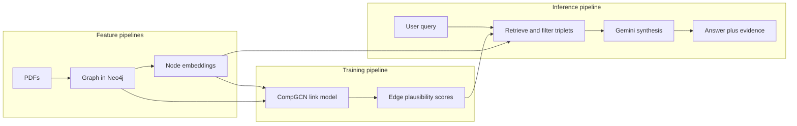

# Slide: Three pipelines (Labarta framing)

**Use in:** Mid evaluation, final defense, or adviser review — aligns modular ML storytelling with [Pau Labarta Bajo — *Let's build a Real Time ML System*](https://paulabartabajo.substack.com/p/lets-build-a-real-time-ml-system-efb) (feature / training / inference) and enterprise pipeline thinking from [Google Cloud — Vertex AI foundations](https://cloud.google.com/blog/topics/developers-practitioners/vertex-ai-foundations-secure-and-compliant-mlai-deployment).

---

## Title

**The Remembrance: three pipelines, not “just a chatbot”**

**Subtitle (optional):** *Reference UI; research contribution = validate-then-generate architecture.*

---

## One-sentence framing

We separate **what we store and featurize** (graph + embeddings), **what we train** (GNN plausibility on edges), and **what we run at query time** (retrieve, filter, synthesize)—the same modular idea as production ML systems, without requiring a specific cloud vendor.

---

## Diagram (Mermaid — paste into Slides, Notion, or export as image)

---

## Mapping table (speaker notes)

| Labarta bucket | The Remembrance | Artifacts |
|----------------|-----------------|-----------|
| **Feature** | Ingest + embed | Neo4j nodes/edges; DistilBERT vectors on nodes |
| **Training** | GNN audit | `plausibility_score` / `audit_status` on relationships |
| **Inference** | Chat / stream | GraphRetriever → filtered triplets → Gemini → Detective Board |

**Fourth block (optional):** `POST /evaluate` → grounding/faithfulness JSON (offline / monitoring analogue, not user-facing inference).

---

## Bullets for the slide (if no diagram)

1. **Feature:** PDFs → schema-guided extraction → Neo4j graph → node embeddings.  
2. **Training:** CompGCN link prediction → scores on every relationship.  
3. **Inference:** Query → hybrid retrieval → **only validated context** → narrative + evidence trail.

---

## Expected panel question

**Q: Why not one box “AI”?**  
**A:** Because **training** (when the GNN runs) and **inference** (when the user asks) are different operations with different artifacts—same reason production systems split feature, training, and serving pipelines.
